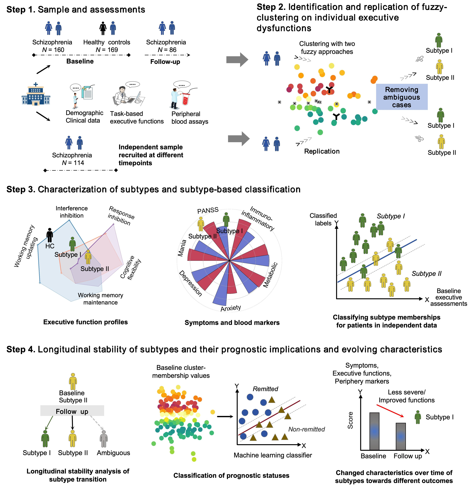

# EF-Based Subtyping in Schizophrenia

This repository contains the source code for our paper "Heterogeneous executive functions in schizophrenia delineate patient subtypes with different symptom profiles, inflammatory levels, and treatment responses: a cross-time clustering and validation study."

*Figure 1. Study overview.*

---

## Abstract

**Background:** Executive function (EF) is a heterogeneous neuropsychological construct, and impairments in EF dimensions represent a core aspect of psychopathology in schizophrenia that vary across individual patients. Currently, how this inter-individual variability characterizes schizophrenia subgroups, along with their distinctions in clinical characteristics and prognostic outcomes, remains unclear.

**Methods:** Three EF dimensions (inhibitory control, working memory, cognitive flexibility) were assessed in the main sample (N=329), its follow-up subset, and an independently "recurring local validation" patient sample (N=114). Fuzzy clustering was applied to baseline EF assessments to discover and validate the core subtypes after excluding cluster-ambiguous cases in the main and independent samples, respectively. Subtype-based classification trained on the main sample was then tested in the independent sample. Importantly, the stability of these subtypes and their remission statuses, along with associated longitudinal changes in clinical and biological factors, were evaluated, and baseline subtype memberships were also used to predict outcomes.

**Results:** Two longitudinal stable, independently validated core EF subtypes were identified, with significantly variable baseline positive, affective, and cognitive symptoms; working memory updating functioning; and peripheral inflammatory and metabolic levels. This two-subtype differentiation allowed an accurate classification of novel patients' subtype memberships and patients' remission statuses not due to overall severity at intake. Remitted patients experienced significantly greater reductions in negative and cognitive symptoms, improved working memory maintenance, lower peripheral inflammatory levels, and more-superior metabolic functions over time.

**Conclusions:** EF subtyping successfully captured the symptomatic, biochemical, and prognostic variations in individuals with schizophrenia, which could help to stratify patients with this disorder for targeted treatments.

**Keywords:** Executive dysfunction; Machine learning clustering; Prognostic prediction; Peripheral immune-metabolic; Schizophrenia; Subtyping

---

## Citation

[Author names]. ([Year]). Heterogeneous executive functions in schizophrenia delineate patient subtypes with different symptom profiles, inflammatory levels, and treatment responses: a cross-time clustering and validation study. *[Journal Name]*. [DOI]

**Note:** Citation information will be updated upon publication.
